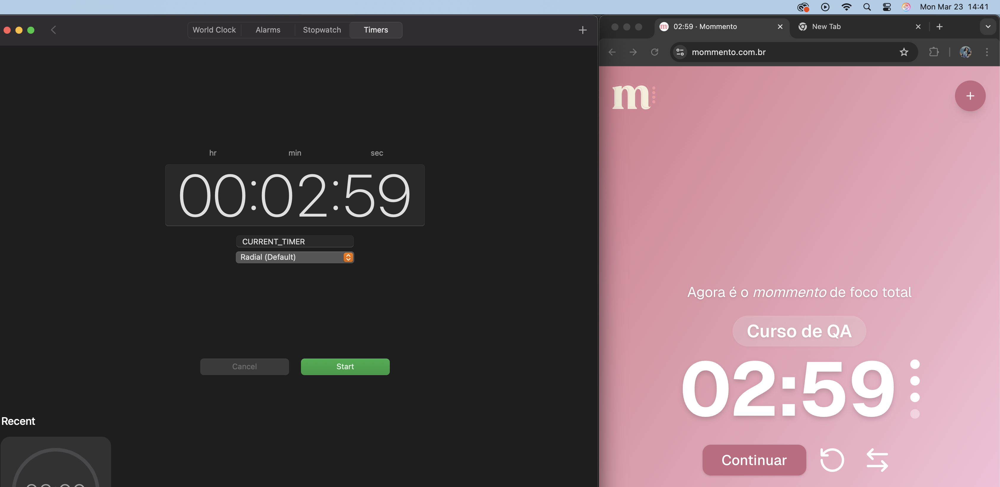
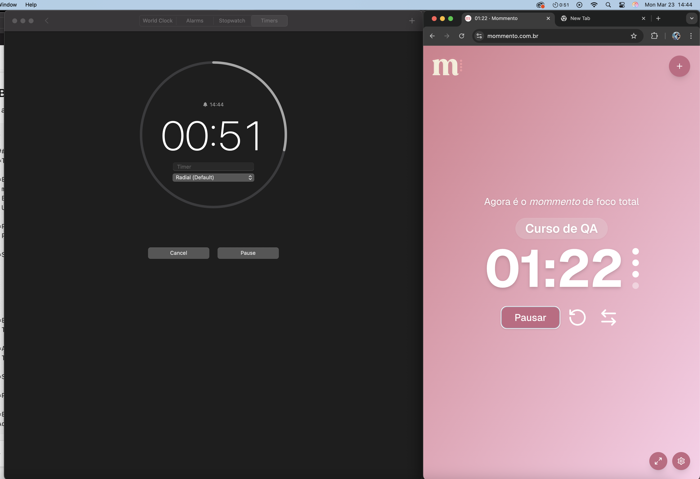

### Bug ID: BUG-01  
**Title:** "Continuar" button is displayed after clicking "Resetar Timer" instead of "Iniciar"  

**Environment:**  
- macOS  
- Browsers: Safari, Google Chrome  
- URL: https://www.mommento.com.br  

**Preconditions:**  
- Pomodoro timer has been started  
- Timer is either running or paused  

**Steps to Reproduce:**
1. Click on the "Resetar Timer" button  
2. Observe the control button below the timer  

**Expected Result:**  
- The control button should display "Iniciar" after resetting the timer  

**Actual Result:**  
- The control button displays "Continuar" instead of "Iniciar"  

**Severity:** Medium  

**Priority:** Medium  

**Evidence:**  

---

### Bug ID: BUG-02  
**Title:** Timer runs slower when the browser tab is inactive  

**Environment:**  
- macOS  
- Browsers: Safari, Google Chrome  
- URL: https://www.mommento.com.br  

**Preconditions:**  
- Pomodoro timer is running  

**Steps to Reproduce:**
1. Start the Pomodoro timer  
2. Switch to another browser tab or minimize the browser  
3. Wait for a few minutes  
4. Return to the Mommento tab  
5. Compare the elapsed time with real time  

**Expected Result:**  
- The timer should continue running accurately even when the tab is inactive  

**Actual Result:**  
- The timer runs slower than expected when the tab is not active  

**Severity:** High  

**Priority:** High  

**Evidence:** 
[Watch video evidence](../evidence/bug-02.mov)
